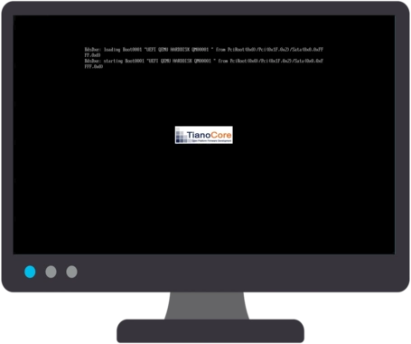

# Alpine Web Kiosk

AWK is a web kiosk based on [Alpine Linux](https://www.alpinelinux.org/) (3.23)


## installation

> changes may be necessary (keyboard `fr`, disk `sda`, …)<br/>
> **be sure to select correct disk if there are multiple available**<br/>
> **Secure Boot must be disabled on EFI/UEFI platform**<br/>
> prefer installation under EFI/UEFI, especially if it is performed to removable media<br/>

- boot Alpine Linux ISO image on PC containing media storage for the future web kiosk
- login as `root` without a password (empty password)
- start installation with `KERNELOPTS="quiet mitigations=off" ROOTFS=btrfs setup-alpine`
  - keymap `fr`
  - keyboard layout `fr`
  - hostname `AWK`
  - initialize interface `eth0`
  - ip address `dhcp`
  - root password `**********`
  - timezone `Europe`
  - sub timezone `Paris`
  - proxy `none`
  - ntp client `busybox`
  - apk mirror `c` (community) `22` (mirros.ircam.fr)
  - user `browser`
  - full name `Chromium`
  - password `chromium`
  - retype password `chromium`
  - ssh key or URL `none`
  - ssh server `openssh`
  - allow root ssh `prohibit-password`
  - ssh key or URL `none`
  - disk `sda`
  - type `sys`
  - erase `y`
- update system `apk update && apk upgrade`
- reboot `reboot`


## configuration

> changes may be necessary (SSH public key, disk `sda`, …)<br/>
> **be sure to select correct disk if there are multiple available**

- boot AWK from media storage selected during installation
- login as `root` with defined password
- modify EFI System Partition (ESP)
> installation is assumed to have been performed under EFI/UEFI<br/>
> if this is not case, only run last command `dosfslabel …`
```sh
apk add gptfdisk
gdisk /dev/sda <<~~~
t
1
0700
c
1
AWK
c
2
SWAP
c
3
ROOT
w
y
~~~
apk add mtools
echo 'drive e: file="/dev/sda1"' > /etc/mtools.conf
mattrib +h +s e:/efi 2> /dev/null
dosfslabel /dev/sda1 AWK &> /dev/null
```
- make few minor changes
```sh
echo -n | tee /etc/issue > /etc/motd
sed -i 's/^wheel:x:10:root,browser/wheel:x:10:root/' /etc/group
sed -i -r \
  -e '/^\/dev\/(cdrom|usb)/d' \
  -e 's/iocharset=utf8/iocharset=iso8859-1,utf8/' \
  /etc/fstab
```
- add widest hardware support (AWK on a USB device)
```sh
apk add linux-firmware
```
- modify GRUB loader (quiet boot)
```sh
chmod -x /etc/grub.d/*
chmod +x /etc/grub.d/00_header
chmod +x /etc/grub.d/10_linux
echo "
GRUB_TIMEOUT_STYLE=hidden
GRUB_DISABLE_OS_PROBER=true
" >> /etc/default/grub
grub-mkconfig |
sed -e "s/'Loading Linux lts/; echo '  Loading AWK/" \
    -e "/Loading initial ramdisk/d" > /boot/grub/grub.cfg
```
- make dynamic hostname (MAC based / multiple kiosks on same LAN)
```sh
cat > /etc/init.d/machostname <<\~~~
#!/sbin/openrc-run
depend()
{
	after hostname
}
start()
{
	hostname AWK-$(
	  ip link show dev eth0 |
	  awk '/link\/ether/{print$2}' |
	  tr -d ':'
	)
}
~~~
chmod +x /etc/init.d/machostname
rc-update add machostname boot
service machostname start
```
- configure remote access (remote administration)
> generate an SSH key pair from administration workstation `ssh-keygen -t ed25519 -C comment -f ./AWK.key`<br/>
> use content of public key `cat ./AWK.key.pub` below or copy public key to `~/.ssh/authorized_keys` at AWK
```sh
mkdir ~/.ssh/
echo "ssh-ed25519 … … … … … comment" > ~/.ssh/authorized_keys
```
- install graphics server, applications and extensions
```sh
setup-xorg-base
apk add xf86-input-synaptics setxkbmap
apk add font-dejavu font-inconsolata font-liberation font-linux-libertine font-noto-emoji ttf-freefont
apk add jwm
apk add chromium chromium-lang
cat > /etc/X11/xorg.conf <<~~~
Section "ServerFlags"
	 Option "DontVTSwitch" "true"
	 Option "DontZap" "true"
EndSection
~~~
```
- setup default web page
```sh
rc-update add local default
cat > /etc/local.d/default.web.page.start <<\~~~
mkdir -p "${root:=/boot/efi/www}"
[ -f "${index:=$root/index.html}" ] ||
echo '<html style="background-color:#0E5980;color:#00ccff;font-family:sans;font-style:italic;font-weight:bold">
<title>AWK</title>
<div style="font-size:4em;text-align:center">
<br/><br/>
<svg xmlns="http://www.w3.org/2000/svg" width="256" height="132" style="background-color:#0e5980">
<path fill="none" stroke="#fff" stroke-linejoin="round" stroke-width="16.83" d="M8.76 92.677 93.931 9.54l85.171 83.137m68.138 0-76.655-74.824-17.034 16.628M78.38 67.736v24.941"/>
<path fill="none" stroke="#1b93c0" stroke-linejoin="round" stroke-width="13.804" d="m62.975 114.094-11.9 11.9"/>
<path fill="none" stroke="#1b93c0" stroke-linejoin="round" stroke-width="17" d="M22.684 113.682h210.632Z"/>
<text xml:space="preserve" x="17.313" y="102.104" fill="#00ccff" font-family="sans-serif" font-size="85.333" style="line-height:1.25"><tspan x="17.313" y="102.104" font-family="DejaVu Sans" font-style="oblique" font-weight="700" style="-inkscape-font-specification:&quot;DejaVu Sans Bold Oblique&quot;">AWK</tspan></text>
</svg>
</br>Alpine Web Kiosk
</div>
</html>' > "$index"
~~~
chmod +x /etc/local.d/default.web.page.start
service local start
```
- configure system initialization (minimum, silent, and auto-login for `browser` user)
> **no console access with this `/etc/inittab` configuration**<br/>
> uncomment `#tty2::respawn:/sbin/getty 38400 tty2` for console access<br/>
> and/or uncomment `#ttyS0::respawn:/sbin/getty -L 0 ttyS0 vt100` for serial console access<br/>
> and/or access AWK via secure shell<br/>
> sleep may be added to make it easier to read assigned network address
```sh
cat > /etc/inittab <<~~~
::sysinit:clear
::sysinit:echo $'\n\n  Starting AWK ...\n\n'
::sysinit:/sbin/openrc sysinit   -q > /dev/null
::sysinit:/sbin/openrc boot      -q > /dev/null
#::sysinit:sleep 3s
::wait:/sbin/openrc default      -q > /dev/null
tty1::respawn:/bin/login -f browser
#tty2::respawn:/sbin/getty 38400 tty2
#ttyS0::respawn:/sbin/getty -L 0 ttyS0 vt100
::ctrlaltdel:clear
::ctrlaltdel:/sbin/reboot        -q > /dev/null
::shutdown:clear
::shutdown:/sbin/openrc shutdown -q > /dev/null
~~~
```
- configure login for `browser` user (graphics server automatic startup at login)
```sh
cat > /home/browser/.profile <<~~~
clear
echo $'\n\n  Starting browser ...'
export LANG=fr
export LC_COLLATE=C
rm -rf \
  ~/.Xauthority \
  ~/.serverauth.* \
  ~/.cache/chromium \
  ~/.config/chromium \
  &> /dev/null
exec startx &>/dev/null
~~~
```
- configure window manager's startup
```sh
cat > /home/browser/.xinitrc <<~~~
setxkbmap fr
xset -dpms
xset s off
xset s noblank
exec jwm
~~~
```
- set up web browser auto-start
```sh
cat > /home/browser/.jwmrc <<\~~~
<?xml version="1.0" encoding="UTF-8"?>
<JWM>
<Key mask="A" key="Tab">nextstacked</Key>
<Key mask="AS" key="Tab">prevstacked</Key>
<StartupCommand>
yes '' | head -256 > /dev/tty1
clear > /dev/tty1
chromium \
  --start-maximized \
  --no-first-run \
  --autoplay-policy=no-user-gesture-required \
  --disable-infobars \
  --disable-session-crashed-bubble \
  --disable-restore-session-state \
  --disable-component-update \
  --check-for-update-interval=315360000 \
  --disable-pinch \
  --disable-features=TranslateUI \
  --disable-extensions \
  --disable-background-networking \
  --disable-sync \
  --disable-default-apps \
  --process-per-site \
  --disk-cache-size=0 \
  --password-store=basic \
  --noerrdialogs \
  $(
  [ -f "${urls:=/boot/efi/urls.txt}" ] &&
  grep -E '^(file|http(s)?)://' "$urls" ||
  echo file:///boot/efi/www/index.html
  )
jwm -exit
</StartupCommand>
</JWM>
~~~
```


## Chromium configuration

- disable `file://` scheme (except for default web page)
```sh
mkdir -p /etc/chromium/policies/managed/
cat > /etc/chromium/policies/managed/block_file.json <<~~~
{
  "URLAllowlist": ["file:///boot/efi/www/"],
  "URLBlocklist": ["file://"]
}
~~~
```


## web kiosk customization

### `%part1%/urls.txt`

> `/boot/efi/urls.txt` on AWK

`urls.txt` file, located in root directory of first partition, tells browser which web page(s) to open and can be easily installed and configured

```ini
# default updated web page for kiosk user guide
file:///boot/efi/www/index.html
# DuckDuckGo
https://duckduckgo.com/
# AWK ;-)
https://github.com/patatetom/AWK/
```

### `%part1%/www/index.html`

> `/boot/efi/www/index.html` on AWK

`index.html` file, stored in `/www/` folder located in root of first partition, is default web page opened by browser and can be easily updated and expanded


## screencast

[](boot.large.webp)
