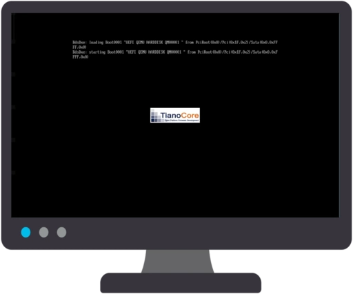

# Alpine Web Kiosk

AWK is a web kiosk based on [Alpine Linux](https://www.alpinelinux.org/) (3.23)

_with this repo, you can (quickly and easily) set up a web kiosk based on Alpine Linux and Chromium web browser :_
_«&nbsp;a web kiosk is a self-service computer terminal accessible to the public that allows users to view informations or perform actions via web interfaces in a limited and controlled manner&nbsp;»_


## installation

> changes may be necessary (keyboard `fr`, disk `sda`, …)<br/>
> **be sure to select correct disk if there are multiple available**<br/>
> **Secure Boot must be disabled on EFI/UEFI platform**<br/>
> prefer installation under EFI/UEFI, especially if it is performed to removable media<br/>

- boot Alpine Linux ISO image on PC containing media storage for the future web kiosk
- login as `root` without a password (empty password)
- start installation with `KERNELOPTS="quiet mitigations=off" ROOTFS=btrfs setup-alpine`
  - keymap `fr`
  - keyboard layout `fr`
  - hostname `AWK`
  - initialize interface `eth0`
  - ip address `dhcp`
  - root password `**********`
  - timezone `Europe`
  - sub timezone `Paris`
  - proxy `none`
  - ntp client `busybox`
  - apk mirror `c` (community) `22` (mirros.ircam.fr)
  - user `browser`
  - full name `Chromium`
  - password `chromium`
  - retype password `chromium`
  - ssh key or URL `none`
  - ssh server `openssh`
  - allow root ssh `prohibit-password`
  - ssh key or URL `none`
  - disk `sda`
  - type `sys`
  - erase `y`
- update system `apk update && apk upgrade`
- reboot `reboot`


## configuration

> changes may be necessary (SSH public key, disk `sda`, …)<br/>
> **be sure to select correct disk if there are multiple available**

- boot AWK from media storage selected during installation
- login as `root` with defined password

> [!TIP]
> entire configuration process described below can be automated using [setup-AWK](setup-AWK) script

- change domain name resolution
```sh
apk add dnsmasq
rc-update add dnsmasq
cat > /etc/dnsmasq.conf << 'xxxxxxxx'
resolv-file=/etc/resolv.dnsmasq
domain-needed
bogus-priv
interface=lo
no-dhcp-interface=lo
listen-address=127.0.0.1,::1
bind-interfaces
cache-size=2048
xxxxxxxx
chattr -i /etc/resolv.conf
cat > /etc/resolv.conf << 'xxxxxxxx'
nameserver 127.0.0.1
nameserver ::1
xxxxxxxx
chattr +i /etc/resolv.conf
rc-service dnsmasq start
echo 'RESOLV_CONF="/etc/resolv.dnsmasq"' > /etc/udhcpc/udhcpc.conf
rc-service networking restart
```
- modify EFI System Partition (ESP)
> installation is assumed to have been performed under EFI/UEFI<br/>
> if this is not case, only run last command `dosfslabel …`
```sh
apk add sgdisk
sgdisk /dev/sda \
    --typecode=1:0700 --change-name=1:AWK \
    --typecode=2:8200 --change-name=2:SWAP \
    --typecode=3:8300 --change-name=3:ROOT
apk add mtools
echo 'drive e: file="/dev/sda1"' > /etc/mtools.conf
mattrib +h +s e:/efi 2> /dev/null
dosfslabel /dev/sda1 AWK > /dev/null 2>&1
```
- make few minor changes
```sh
: | tee /etc/issue > /etc/motd
sed -i 's/^wheel:x:10:root,browser/wheel:x:10:root/' /etc/group
sed -i -E \
  -e '/^\/dev\/(cdrom|usb)/d' \
  -e 's/iocharset=utf8/iocharset=iso8859-1,utf8/' \
  /etc/fstab
```
- add widest hardware support (AWK on a USB device)
```sh
apk add linux-firmware
```
- modify GRUB loader (quiet boot)
```sh
chmod -x /etc/grub.d/*
chmod +x /etc/grub.d/00_header
chmod +x /etc/grub.d/10_linux
if ! grep -q '^GRUB_TIMEOUT_STYLE=hidden' /etc/default/grub; then
  cat >> /etc/default/grub << 'xxxxxxxx'

GRUB_TIMEOUT_STYLE=hidden
GRUB_DISABLE_OS_PROBER=true
xxxxxxxx
fi
rc-update add local default
cat > /etc/local.d/grub.echo.stop << 'xxxxxxxx'
#!/bin/sh
if grep -q 'Loading Linux lts' /boot/grub/grub.cfg; then
  grub-mkconfig \
    | sed -e "s/'Loading Linux lts/; echo '  Loading AWK/" \
          -e '/Loading initial ramdisk/d' \
    > /boot/grub/grub.cfg
fi
xxxxxxxx
chmod +x /etc/local.d/grub.echo.stop
```
- make dynamic hostname (MAC based / multiple kiosks on same LAN)
```sh
cat > /etc/init.d/machostname << 'xxxxxxxx'
#!/sbin/openrc-run
depend()
{
  after hostname
}
start()
{
  hostname AWK-$( tr -d ':' < /sys/class/net/eth0/address )
}
xxxxxxxx
chmod +x /etc/init.d/machostname
rc-update add machostname boot
rc-service machostname start
```
- configure remote access (remote administration)
> generate an SSH key pair from administration workstation `ssh-keygen -t ed25519 -C comment -f ./AWK.key`<br/>
> use content of public key `cat ./AWK.key.pub` below or copy public key to `~/.ssh/authorized_keys` at AWK
```sh
mkdir -p ~/.ssh/
echo "ssh-ed25519 … … … … … comment" > ~/.ssh/authorized_keys
chmod 600 ~/.ssh/authorized_keys
```
- install graphics server, applications and extensions
```sh
setup-xorg-base
apk add setxkbmap
apk add font-dejavu font-inconsolata font-liberation font-linux-libertine font-noto-emoji ttf-freefont
apk add jwm
apk add chromium chromium-lang
cat > /etc/X11/xorg.conf << 'xxxxxxxx'
Section "ServerFlags"
  Option "DontVTSwitch" "true"
  Option "DontZap" "true"
EndSection
Section "InputClass"
  Identifier "touchpad"
  MatchDriver "libinput"
  MatchIsTouchpad "on"
  Option "Tapping" "on"
  Option "NaturalScrolling" "on"
EndSection
xxxxxxxx
```
- setup default web page
```sh
cat > /etc/local.d/default.web.page.start << 'xxxxxxxx'
#!/bin/sh
mkdir -p "${root:=/boot/efi/www}"
ln -sf "$root" /
if [ ! -f "${index:=$root/AWK.html}" ]; then
  cat > "$index" << 'oooooooo'
<html style="background-color:#0E5980;color:#00ccff;font-family:sans;font-style:italic;font-weight:bold">
<title>AWK</title>
<div style="font-size:4em;text-align:center"><br/><br/>
<svg width="256" height="132" xmlns="http://www.w3.org/2000/svg">
<path style="fill:#0e5980;fill-opacity:1;fill-rule:evenodd;stroke:none;stroke-linecap:round;stroke-linejoin:round;paint-order:fill markers stroke" d="M16 0h224c8.864 0 16 7.136 16 16v100c0 8.864-7.136 16-16 16H16c-8.864 0-16-7.136-16-16V16C0 7.136 7.136 0 16 0Z"/>
<g stroke="#000" stroke-linejoin="round" stroke-width="16.83"><path d="m9.662 93.904 85.171-83.137 85.171 83.137M248.142 93.904 171.487 19.08l-17.034 16.628M79.282 68.963v24.941" style="fill:none;stroke:#fff;stroke-opacity:1" transform="translate(-.902 -1.227)"/></g>
<path stroke="#000" stroke-linejoin="round" d="m62.975 115.321-11.9 11.9" stroke-width="13.804" style="fill:none;stroke:#1b93c0;stroke-opacity:1" transform="translate(0 -1.227)"/>
<path style="fill:none;stroke:#1b93c0;stroke-width:17.0001;stroke-linecap:butt;stroke-linejoin:round;stroke-dasharray:none;stroke-dashoffset:0;stroke-opacity:1" d="M22.684 114.909h210.632Z" transform="translate(0 -1.227)"/>
<text xml:space="preserve" style="font-size:85.3333px;line-height:1.25;font-family:sans-serif;fill:#0cf" x="17.313" y="103.104"><tspan x="17.313" y="103.104" style="font-style:oblique;font-variant:normal;font-weight:700;font-stretch:normal;font-size:85.3333px;font-family:'DejaVu Sans';-inkscape-font-specification:'DejaVu Sans Bold Oblique';fill:#0cf;fill-opacity:1">AWK</tspan></text>
</svg>
</br>Alpine Web Kiosk
</div>
</html>
oooooooo
fi
xxxxxxxx
chmod +x /etc/local.d/default.web.page.start
rc-service local start
```
- configure system initialization (minimum, silent, and auto-login for `browser` user)
> **no console access with this `/etc/inittab` configuration**<br/>
> uncomment `#tty2::respawn:/sbin/getty 38400 tty2` to retain console access<br/>
> and/or uncomment `#ttyS0::respawn:/sbin/getty -L 0 ttyS0 vt100` for serial console access<br/>
> and/or access AWK via secure shell (prefered)<br/>
> sleep may be added (uncomment) to make it easier to read assigned network address (see also [conky](conky.md))
```sh
cat > /etc/inittab << 'xxxxxxxx'
::sysinit:clear
::sysinit:printf '\n\n  Starting AWK ...\n\n'
::sysinit:/sbin/openrc sysinit -q > /dev/null
::sysinit:/sbin/openrc boot -q > /dev/null
#::sysinit:sleep 3s
::wait:/sbin/openrc default -q > /dev/null
tty1::respawn:/bin/login -f browser
#tty2::respawn:/sbin/getty 38400 tty2
#ttyS0::respawn:/sbin/getty -L 0 ttyS0 vt100
::ctrlaltdel:clear
::ctrlaltdel:/sbin/reboot -q > /dev/null
::shutdown:clear
::shutdown:/sbin/openrc shutdown -q > /dev/null
xxxxxxxx
```
- configure login for `browser` user (graphics server automatic startup at login)
> `~/.chromium.tgz` is a pre-configuration for Chromium (view file in repository)
```sh
cat > /home/browser/.profile << 'xxxxxxxx'
clear
printf '\n\n  Starting browser ...\n'
export LANG=fr
export LC_COLLATE=C
rm -rf \
  ~/.Xauthority* \
  ~/.serverauth.* \
  ~/.cache/chromium \
  ~/.config/chromium \
  > /dev/null 2>&1
tar -C ~ -xf ~/.chromium.tgz > /dev/null 2>&1
exec startx > /dev/null 2>&1
xxxxxxxx
```
- configure window manager's startup
```sh
cat > /home/browser/.xinitrc << 'xxxxxxxx'
setxkbmap fr
xset -dpms
xset s off
xset s noblank
exec jwm
xxxxxxxx
```
- set up web browser auto-start
```sh
cat > /home/browser/.jwmrc << 'xxxxxxxx'
<?xml version="1.0" encoding="UTF-8"?>
<JWM>
<StartupCommand>
clear > /dev/tty1
if [ -f "${urls:=/boot/efi/urls.txt}" ]; then
  urls=$( grep -E -o '^(file|http(s)?)://[^ ]+' "$urls" )
else
  urls=file:///www/AWK.html
fi
chromium \
  --start-maximized \
  --no-first-run \
  --autoplay-policy=no-user-gesture-required \
  --disable-infobars \
  --disable-session-crashed-bubble \
  --disable-restore-session-state \
  --disable-component-update \
  --check-for-update-interval=315360000 \
  --disable-pinch \
  --disable-features=TranslateUI \
  --disable-extensions \
  --disable-background-networking \
  --disable-sync \
  --disable-default-apps \
  --process-per-site \
  --disk-cache-size=0 \
  --password-store=basic \
  --noerrdialogs \
  "$urls"
rm -rf \
  ~/.serverauth.* \
  ~/.cache/chromium \
  ~/.config/chromium
jwm -exit
</StartupCommand>
</JWM>
xxxxxxxx
```


## Chromium configuration

- disable `file://` scheme (except for default web page) et fix download directory
```sh
mkdir -p /etc/chromium/policies/managed/
cat > /etc/chromium/policies/managed/AWK.json << 'xxxxxxxx'
{
  "URLAllowlist": ["file:///www/"],
  "URLBlocklist": ["file://"],
  "DownloadRestrictions": 3,
  "DownloadDirectory": "/tmp/"
}
xxxxxxxx
```
- install provided pre-configuration (optional)
> this file is used in `/home/browser/.profile`
```
wget -O /home/browser/.chromium.tgz \
https://github.com/patatetom/AWK/raw/refs/heads/main/chromium.config.tgz
# check tgz file
# tar tvzf /home/browser/.chromium.tgz
```


## web kiosk customization

### `%part1%/urls.txt`

> `/boot/efi/urls.txt` on AWK

`urls.txt` file, located in root directory of first partition, tells browser which web page(s) to open and can be easily installed and configured

```ini
# default updated web page for kiosk user guide
file:///www/AWK.html
# DuckDuckGo
https://duckduckgo.com/
# AWK ;-)
https://github.com/patatetom/AWK/
```

### `%part1%/www/AWK.html`

> `/boot/efi/www/AWK.html` or `/www/AWK.html` (symlink) on AWK

`AWK.html` file, stored in `/www/` folder located in root of first partition, is default web page opened by browser and can be easily updated and expanded


## notes

- AWK is « French-oriented »
- ESP partition is redesigned when installing on removable USB media (Windows with portable kiosk)
- BTRFS file system is preferred over EXT4 when installing on removable USB media (portable kiosk)
- [audio](audio.md) and [printing](printing.md) functions are not built-in but can be easily added
- [WiFi](wifi.md) connectivity is not built-in but can be easily added
- press `ESC` at boot to access GRUB bootloader and press `E` to edit/add/change kernel parameters
- transferring AWK from one media storage to another usually requires fixing GPT (some EFI/UEFI platforms refuse to boot if backup GPT is not valid)


## screencast

[](AWK.large.webp)
