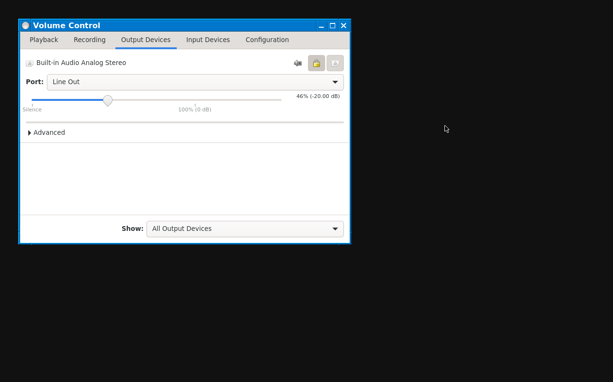

## PulseAudio

sound support can be added to AWK using the following commands

```sh
# add dbus
apk add dbus
rc-update add dbus
rc-service dbus start

# add sound open firmware
apk add sof-firmware

# add pulseaudio, set default volume to 100% on all output
# and switch on new device
apk add pulseaudio pulseaudio-utils
if ! grep -q 'volume @DEFAULT_SINK@ 0x10000' /etc/pulse/default.pa; then
  cat >> /etc/pulse/default.pa << 'xxxxxxxx'

set-sink-volume @DEFAULT_SINK@ 0x10000
load-module module-switch-on-connect
xxxxxxxx
fi

# add output/volume control and bind [Window]-[S] (sound)
# or [Window]-[V] (volume) to pavucontrol
apk add pavucontrol xbindkeys
mkdir -p /home/browser/.config

cat > /home/browser/.config/pavucontrol.ini << 'xxxxxxxx'
[window]
width=688
height=442
showVolumeMeters=1
hideUnavailableCardProfiles=1
xxxxxxxx

cat > /home/browser/.xbindkeysrc << 'xxxxxxxx'
"killall pavucontrol; pavucontrol &"
  Mod4 + S
"killall pavucontrol; pavucontrol &"
  Mod4 + V
"pactl set-sink-volume @DEFAULT_SINK@ +1000"
  XF86AudioRaiseVolume
"pactl set-sink-volume @DEFAULT_SINK@ +1000"
  Mod4 + 2
"pactl set-sink-volume @DEFAULT_SINK@ -1000"
  XF86AudioLowerVolume
"pactl set-sink-volume @DEFAULT_SINK@ -1000"
  Mod4 + 3
"pactl set-sink-mute @DEFAULT_SINK@ toggle"
  XF86AudioMute
"pactl set-sink-mute @DEFAULT_SINK@ toggle"
  Mod4 + 1
"pactl set-source-mute @DEFAULT_SOURCE@ toggle"
  XF86AudioMicMute
"pactl set-source-mute @DEFAULT_SOURCE@ toggle"
  Mod4 + 4
xxxxxxxx

if ! grep -q '^xbindkeys' /home/browser/.xinitrc; then
  sed -i '1s/^/xbindkeys\n/' /home/browser/.xinitrc
fi

reboot
```


