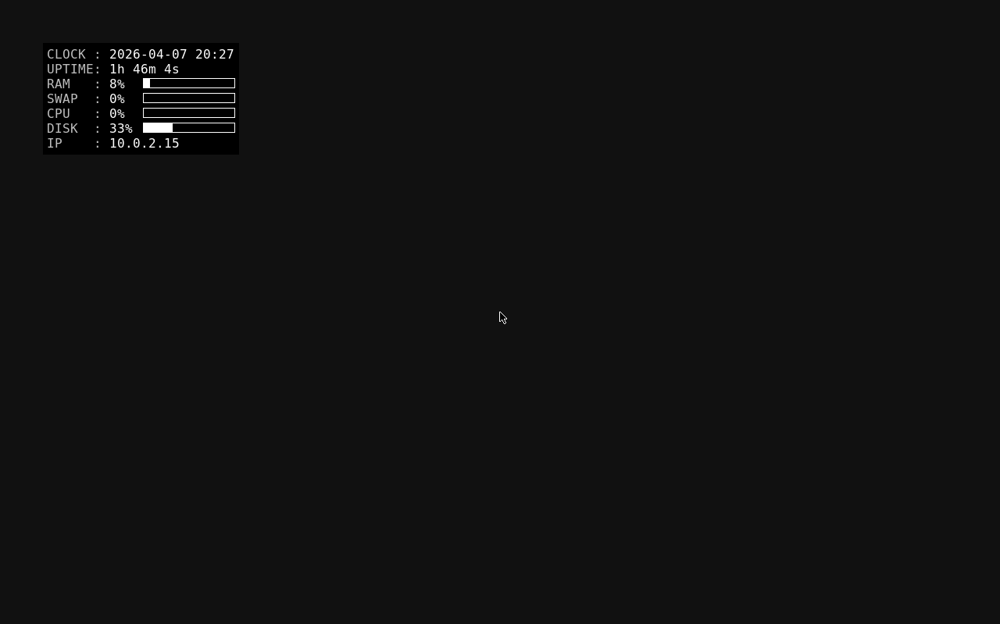

# Conky

you can optionally add Conky to AWK to display system information on the desktop

```sh
# install conky
apk add conky

# configure conky
cat > /home/browser/.conkyrc << 'xxxxxxxx'
conky.text = [[
${color grey}HOST  :$color ${nodename}
${color grey}CLOCK :$color ${time %Y-%m-%d %H:%M}
${color grey}UPTIME:$color $uptime_short
${color grey}RAM   :$color $memperc%${goto 128}${membar 12}
${color grey}SWAP  :$color $swapperc%${goto 128}${swapbar 12}
${color grey}CPU   :$color $cpu%${goto 128}${cpubar 12}
${color grey}DISK  :$color $fs_used_perc%${goto 128}${fs_bar 12 /}
${if_up eth0}${color grey}ETH0  :$color ${addr eth0}${endif}
${if_up wlan0}${color grey}WLAN0 :$color ${addr wlan0}${endif}
]]
conky.config = {
 alignment = 'top_left',
 background = true,
 border_width = 1,
 cpu_avg_samples = 3,
 default_color = 'white',
 default_outline_color = 'white',
 default_shade_color = 'white',
 double_buffer = true,
 draw_borders = false,
 draw_graph_borders = true,
 draw_outline = false,
 draw_shades = false,
 extra_newline = false,
 font = 'DejaVu Sans Mono:size=12',
 gap_x = 60,
 gap_y = 60,
 minimum_height = 5,
 minimum_width = 5,
 net_avg_samples = 2,
 no_buffers = true,
 out_to_console = false,
 out_to_ncurses = false,
 out_to_stderr = false,
 out_to_wayland = false,
 out_to_x = true,
 own_window = true,
 own_window_class = 'Conky',
 own_window_type = 'normal',
 own_window_hints = 'undecorated,sticky,below,skip_taskbar,skip_pager',
 show_graph_range = false,
 show_graph_scale = false,
 stippled_borders = 0,
 update_interval = 3.0,
 uppercase = false,
 use_spacer = 'none',
 use_xft = true
}
xxxxxxxx

# automatically start conky
if ! grep -q '^conky' /home/browser/.xinitrc; then
  sed -i '1s/^/conky\n/' /home/browser/.xinitrc
fi
```


